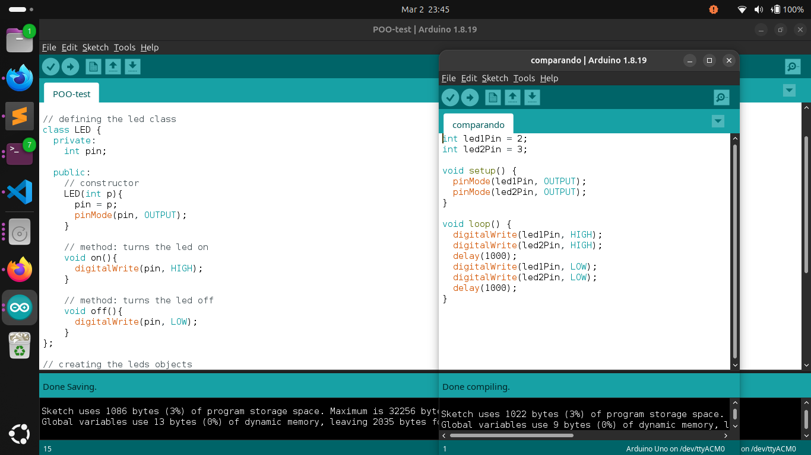

# Arduino LED OOP Example
This is a simple Arduino project to demonstrate **Object-Oriented Programming (OOP)**.
It controls two LEDs using a custom 'LED' class.

## Features
- Turns LEDs on and off in a loop
- Uses a class to manage LEDs
- Easy to expand with more LEDs

## Hardware
- Arduino Uno (or compatible)
- 2 LEDs
- 2 resistors (220Ω recommended)
- Jumper wires
- Breadboard

## Memory Comparison
OOP vs Imperative

